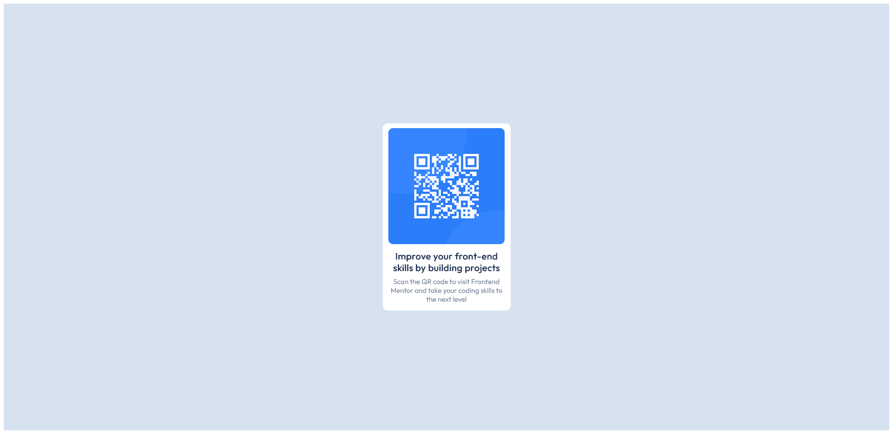

# Frontend Mentor - QR code component solution

This is a solution to the [QR code component challenge on Frontend Mentor](https://www.frontendmentor.io/challenges/qr-code-component-iux_sIO_H). Frontend Mentor challenges help you improve your coding skills by building realistic projects. 

## Table of contents

- [Overview](#overview)
  - [Screenshot](#screenshot)
  - [Links](#links)
- [My process](#my-process)
  - [Built with](#built-with)
  - [What I learned](#what-i-learned)
- [Author](#author)

**Note: Delete this note and update the table of contents based on what sections you keep.**

## Overview

### Screenshot

### Links

- Live Site URL: https://revanshill86.github.io/QR-code-componenet-challenge-using-flexbox/

## My process

### Built with

- Semantic HTML5 markup
- CSS custom properties
- Flexbox

### What I learned

This project was created using HTML and CSS, with a strong focus on achieving precise alignment. To accomplish this, I employed Flexbox, which I've grown more confident in while working on this project.

## Author

- Website - [Randolph Evanshill](https://www.your-site.com)
- Frontend Mentor - @Revanshill86(https://www.frontendmentor.io/profile/Revanshill86)

